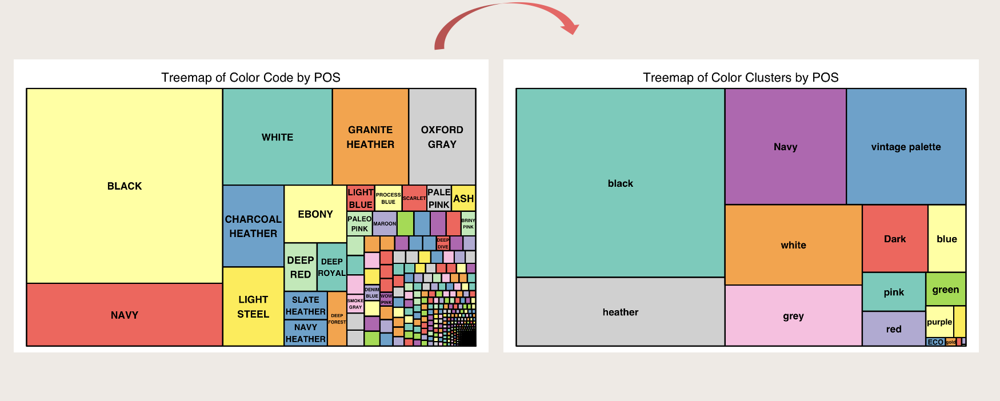

# Color Clustering and Analysis

In a real business world, having too many color codes can be a headache. This Python script performs color clustering and analysis based on the given requirements. It uses the Scikit-learn library for text feature extraction and clustering.

## Installation

Before running the script, make sure you have the following dependencies installed:

- Python 3.x
- Pandas
- Scikit-learn

## Usage

To analyze color descriptions, simply place them in a CSV file, and the script will handle the rest. The script loads and preprocesses color descriptions, identifies base colors, groups similar descriptions, and applies k-means clustering to the 'other' category. Using TF-IDF (Term Frequency-Inverse Document Frequency) for feature extraction, it identifies common themes within each cluster. Finally, it generates a new DataFrame with expanded descriptions for each cluster.

Below is a treemap visualization showing the categorization process: how 983 color descriptions are distilled into 18 distinct groups.

## Code Summary

- Load color descriptions from the color.csv file.
- Define common base colors.
- Identify base color in each description.
- Group descriptions by identified base color or 'other'.
- Apply clustering to descriptions grouped as 'other'.
- Extract the most common words/themes from each cluster.
- Create a new DataFrame with expanded descriptions for each cluster.
- Display the grouped colors DataFrame and the expanded cluster DataFrame.
- Save the grouped colors DataFrame and the expanded cluster DataFrame as CSV files.
